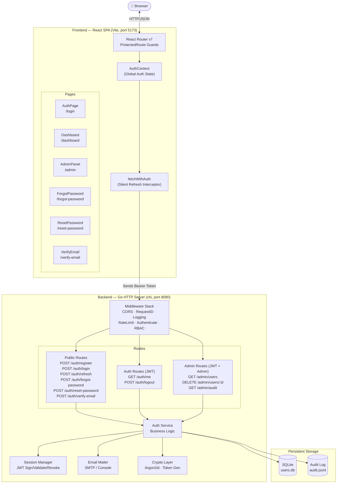
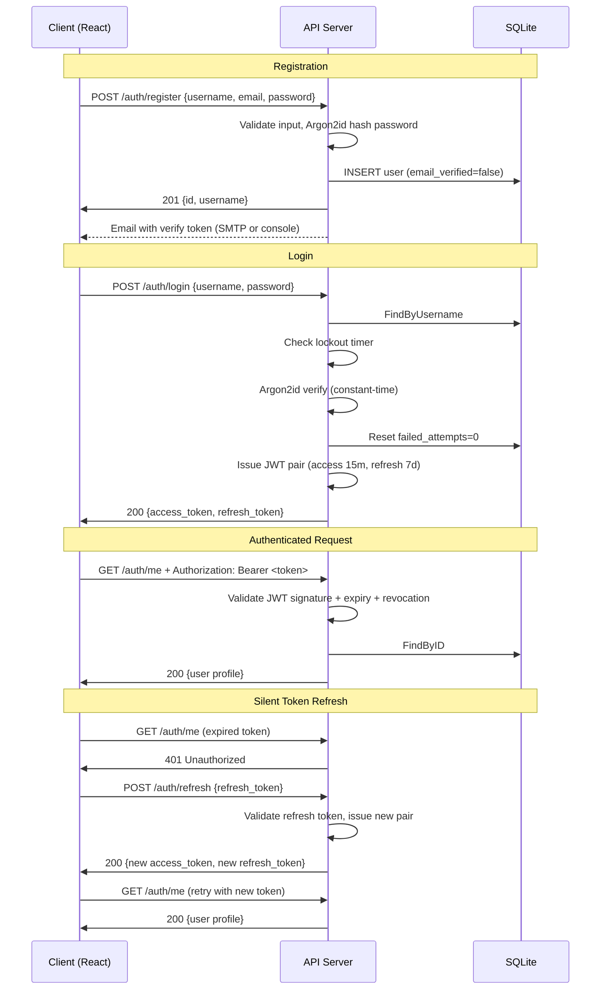

<div align="center">

# 🔐 Go Auth Service

### A production-ready, full-stack authentication system built with Go and React

*Enterprise-grade security in a clean, extensible architecture — showcasing Argon2id hashing, stateless JWT rotation, RBAC, brute-force protection, audit logging, and transactional email delivery.*

[](https://github.com/sakshamkamra33/go-auth-service/actions/workflows/ci.yml)
[](https://go.dev)
[](https://react.dev)
[](https://www.typescriptlang.org)
[](https://sqlite.org)
[](https://docker.com)
[](LICENSE)

</div>

---

## 📖 Overview

**Go Auth Service** is a complete, production-grade authentication service that solves the problem of implementing secure user identity management from scratch. It provides a hardened, battle-tested backend API paired with a polished, modern React frontend — giving developers a solid, production-ready authentication system they can deploy or extend.

### Problem It Solves
Building authentication correctly is notoriously hard. Developers frequently make critical mistakes:
- Storing passwords in plain text or with weak hashing (MD5, SHA1)
- Not protecting against brute-force attacks
- Using long-lived tokens that can't be revoked
- Leaking user existence through error messages

This project demonstrates the correct implementation of every one of these patterns.

### Target Users
- **Developers** who need a secure, production-ready auth service they can clone and extend
- **Recruiters & interviewers** evaluating backend, security, and full-stack engineering skills
- **Students** learning Go, security patterns, JWT, and React SPA architecture

---

## ✨ Features

### 🔐 Security
| Feature | Implementation |
|---|---|
| Password Hashing | Argon2id (RFC 9106) — memory-hard, GPU-resistant |
| Brute Force Protection | Exponential backoff lockout (configurable max attempts) |
| Token Strategy | Short-lived Access JWTs (15 min) + long-lived Refresh tokens (7 days) |
| Token Revocation | In-memory revocation list for active invalidation |
| API Rate Limiting | Custom token-bucket algorithm per client IP (no external dependency) |
| Timing Attack Defense | Constant-time password comparison via crypto/subtle |
| User Enumeration Prevention | Forgot-password always returns HTTP 200 regardless of email existence |
| Input Validation | Username length/charset, password strength enforcement |

### 👥 User Management
- **Role-Based Access Control (RBAC)** — `user` and `admin` roles enforced at the JWT claims level
- **Email Verification Flow** — secure, single-use, 24-hour expiry tokens with auto-cleanup goroutine
- **Password Recovery Flow** — 15-minute expiry reset tokens with single-use enforcement
- **Audit Logging** — every security event (LOGIN_OK, LOGIN_FAIL, REGISTER, LOGOUT, PASSWORD_RESET, EMAIL_VERIFIED) written to a persistent JSONL file with timestamps, request IDs, and detail

### 💻 Full-Stack SPA
- **Protected Routing** — `ProtectedRoute` component redirects unauthenticated users
- **Silent Token Refresh** — custom `fetchWithAuth` client intercepts HTTP 401s, exchanges the refresh token, then retries the original request transparently
- **Dashboard** — displays live profile data: username, email, role badge, verification status, join date
- **Admin Panel** — paginated user table with delete capability (non-admin accounts only); restricted to admin-role JWTs
- **Forgot / Reset Password** pages
- **Email Verification** page (auto-verifies when `?token=` is present in the URL)
- **Glassmorphism UI** — dark mode with blurred glass cards, radial gradients, animated conic border effect, Framer Motion micro-animations

### 🏗️ Architecture Quality
- **Storage-Agnostic Interface** — `UserStore` interface allows swapping SQLite → PostgreSQL without touching business logic
- **Dependency Injection** — all components wired in `main.go`, making mocking and testing trivial
- **Graceful Shutdown** — catches `SIGINT`/`SIGTERM`, drains in-flight requests with 15s timeout
- **Structured Logging** — `slog` with request-ID correlation, latency tracking, and WARN/ERROR levels
- **Zero External Middleware Dependencies** — rate limiter and all middleware written from scratch

---

## 🏛️ Architecture

### High-Level Overview

```
Browser (React SPA)
    │
    │  HTTP/JSON (port 5173 → proxy → 8080)
    ▼
┌─────────────────────────────────────────────┐
│           Go HTTP Server (chi router)        │
│  ┌────────────┐  ┌──────────────────────┐   │
│  │ Middleware │  │     API Handlers       │   │
│  │  - CORS    │  │  - Register/Login     │   │
│  │  - RateLimit│ │  - Me/Logout/Refresh  │   │
│  │  - Auth JWT│  │  - ForgotPw/ResetPw   │   │
│  │  - Logging │  │  - VerifyEmail        │   │
│  │  - RequestID│ │  - Admin: Users/Audit │   │
│  └────────────┘  └──────────────────────┘   │
│                          │                   │
│              ┌───────────┼───────────┐       │
│              ▼           ▼           ▼       │
│         Auth Service  Session Mgr   Mailer   │
│         (business     (JWT issue/   (SMTP /  │
│          logic)        validate/    console) │
│              │         revoke)               │
│         ┌────┴────┐                          │
│         ▼         ▼                          │
│    SQLite DB   Audit Log                     │
│    (users.db)  (audit.jsonl)                 │
└─────────────────────────────────────────────┘
```

### Backend Architecture

The backend follows **clean architecture** principles with strict layer separation:

- **`cmd/server/main.go`** — composition root. Wires every dependency and starts the HTTP server with graceful shutdown.
- **`api/handlers.go`** — thin HTTP handlers. Decode JSON → call auth service → encode response. No business logic lives here.
- **`internal/auth/service.go`** — all business logic: registration, login with lockout, JWT issuance, email verification, password reset.
- **`internal/storage/`** — `UserStore` interface + SQLite implementation. The interface means you can swap the database without touching any other layer.
- **`internal/middleware/middleware.go`** — CORS, request ID injection, structured logging, custom token-bucket rate limiter, JWT authentication, RBAC role check.
- **`internal/session/`** — JWT signing, validation, and in-memory revocation list.
- **`internal/crypto/`** — Argon2id hashing, constant-time verification, and secure random token generation.
- **`internal/email/`** — SMTP mailer with automatic console fallback in development.

### Frontend Architecture

The React SPA uses a **context + interceptor** pattern for clean, global auth state:

- **`AuthContext`** — global state provider. Fetches user profile on mount, exposes `login()`, `logout()`, and `refreshUser()`.
- **`api/client.ts`** — custom `fetchWithAuth()` function that wraps all authenticated requests. Automatically detects HTTP 401 responses, queues pending requests, obtains a new access token via the refresh endpoint, then retries all queued requests.
- **`ProtectedRoute`** — wraps React Router routes. Shows a loading spinner while auth state initialises, then redirects unauthenticated users to `/login` and non-admins away from `/admin`.

---

## 🔄 Architecture Diagram



---

## 🛠️ Tech Stack

| Category | Technology |
|---|---|
| **Backend Language** | Go 1.25 |
| **HTTP Router** | `go-chi/chi` v5 |
| **Password Hashing** | Argon2id (`golang.org/x/crypto`) |
| **Auth Tokens** | JWT (`golang-jwt/jwt` v5) |
| **Database** | SQLite via `modernc.org/sqlite` (pure Go, no CGO) |
| **Logging** | Go standard `log/slog` (structured JSON) |
| **Email** | Go standard `net/smtp` (SMTP with dev console fallback) |
| **Frontend Framework** | React 19 |
| **Language** | TypeScript 5 |
| **Build Tool** | Vite 8 |
| **Routing** | React Router DOM v7 |
| **Animations** | Framer Motion |
| **Icons** | Lucide React |
| **Fonts** | Google Fonts — Inter |
| **Styling** | Vanilla CSS (Glassmorphism design system) |
| **Containerization** | Docker (multi-stage, distroless runtime image) |
| **CI/CD** | GitHub Actions |
| **Static Analysis** | golangci-lint |
| **Vulnerability Scanning** | govulncheck |

---

## 📁 Project Structure

```
go-auth-service/
│
├── .github/
│   └── workflows/
│       └── ci.yml              # CI: build, test, lint, security scan, docker build
│
├── api/
│   └── handlers.go             # HTTP handlers + chi router setup
│
├── cmd/
│   └── server/
│       └── main.go             # Composition root — wires dependencies, starts server
│
├── internal/
│   ├── auth/
│   │   ├── service.go          # Core business logic: register, login, lockout, tokens
│   │   └── auth_test.go        # Unit tests (in-memory fake store, race-detector clean)
│   │
│   ├── config/
│   │   └── config.go           # Env-var config with type-safe defaults
│   │
│   ├── crypto/
│   │   └── ...                 # Argon2id hash/verify, secure token generation
│   │
│   ├── email/
│   │   └── mailer.go           # SMTP sender; prints to console when SMTP_HOST unset
│   │
│   ├── logger/
│   │   └── ...                 # slog wrapper with request-ID correlation
│   │
│   ├── middleware/
│   │   └── middleware.go       # CORS, RequestID, Logging, RateLimiter, Auth, RBAC
│   │
│   ├── session/
│   │   └── ...                 # JWT issue/validate/revoke, token-pair model
│   │
│   └── storage/
│       ├── storage.go          # UserStore interface + domain models
│       ├── sqlite.go           # SQLite implementation (no CGO, pure Go driver)
│       └── audit.go            # FileAuditStore — appends events to audit.jsonl
│
├── frontend/
│   ├── src/
│   │   ├── api/
│   │   │   └── client.ts       # fetchWithAuth — JWT interceptor with silent refresh
│   │   │
│   │   ├── context/
│   │   │   └── AuthContext.tsx # Global auth state, user profile, login/logout
│   │   │
│   │   ├── components/
│   │   │   └── ProtectedRoute.tsx # Route guard for authenticated/admin routes
│   │   │
│   │   ├── pages/
│   │   │   ├── AuthPage.tsx       # Login + Registration (animated tab switch)
│   │   │   ├── Dashboard.tsx      # User profile display + Admin Panel link
│   │   │   ├── AdminPanel.tsx     # User listing + delete (admin only)
│   │   │   ├── ForgotPassword.tsx # Request password reset email
│   │   │   ├── ResetPassword.tsx  # Submit new password with reset token
│   │   │   └── VerifyEmail.tsx    # Verify email (auto-verifies from URL token)
│   │   │
│   │   ├── App.tsx                # React Router routes definition
│   │   ├── main.tsx               # React entry point
│   │   └── index.css              # Glassmorphism design system (CSS variables)
│   │
│   ├── package.json
│   └── vite.config.ts
│
├── data/                       # Runtime data (gitignored)
│   ├── users.db                # SQLite database
│   └── audit.jsonl             # Append-only security audit log
│
├── Dockerfile                  # Multi-stage build → distroless runtime
├── docker-compose.yml          # Compose with volume mount for data persistence
├── Makefile                    # Developer shortcuts: run, test, build, lint, docker
├── go.mod
└── go.sum
```

---

## 🚀 Installation

### Prerequisites
- **Go** 1.22+
- **Node.js** 20+ with npm

### 1. Clone the Repository
```bash
git clone https://github.com/sakshamkamra33/go-auth-service.git
cd go-auth-service
```

### 2. Start the Backend

**Windows (PowerShell):**
```powershell
$env:JWT_SECRET="your-min-32-char-secret-here!!!"; go run ./cmd/server
```

**Linux / macOS:**
```bash
JWT_SECRET="your-min-32-char-secret-here!!!" go run ./cmd/server
```

The server starts on `http://localhost:8080`. The `data/` directory and SQLite database are created automatically on first run.

### 3. Start the Frontend
```bash
cd frontend
npm install
npm run dev
```

The app is available at **http://localhost:5173**.

> **Note:** Set `VITE_API_URL=http://localhost:8080/api/v1` in `frontend/.env.local` to point the React app at your local backend (it defaults to the live Render deployment otherwise).

---

## ⚙️ Environment Variables

All backend configuration is loaded from environment variables with safe, documented defaults.

### Backend

| Variable | Default | Description |
|---|---|---|
| `JWT_SECRET` | `CHANGE_ME_use_32+_random_bytes_in_prod` | **Required in production.** Minimum 32 bytes, cryptographically random |
| `PORT` | `8080` | HTTP server port |
| `HOST` | `0.0.0.0` | HTTP server bind address |
| `DATA_DIR` | `./data` | Directory for `users.db` and `audit.jsonl` |
| `ACCESS_TOKEN_EXPIRY` | `15m` | JWT access token lifetime (Go duration string) |
| `REFRESH_TOKEN_EXPIRY` | `168h` | JWT refresh token lifetime (default: 7 days) |
| `MAX_LOGIN_ATTEMPTS` | `5` | Failed attempts before account lockout |
| `LOCKOUT_BASE_DURATION` | `30s` | Base lockout duration — doubles exponentially per extra failure |
| `RATE_LIMIT_REQUESTS` | `20` | Max requests per IP per window |
| `RATE_LIMIT_WINDOW` | `1m` | Rate limit sliding window duration |
| `SMTP_HOST` | *(empty)* | SMTP server hostname. When unset, emails print to console |
| `SMTP_PORT` | `587` | SMTP server port |
| `SMTP_FROM` | *(empty)* | Sender email address |
| `SMTP_PASS` | *(empty)* | SMTP authentication password / app password |
| `DEBUG` | `false` | Set to `true` for verbose debug logging |

### Frontend

| Variable | Default | Description |
|---|---|---|
| `VITE_API_URL` | `https://go-auth-service-6j6d.onrender.com/api/v1` | Backend API base URL |

Create `frontend/.env.local` for local development:
```env
VITE_API_URL=http://localhost:8080/api/v1
```

### Example `.env` (for Docker / production)
```env
JWT_SECRET=use-openssl-rand-hex-32-output-here
PORT=8080
DATA_DIR=/data
ACCESS_TOKEN_EXPIRY=15m
REFRESH_TOKEN_EXPIRY=168h
MAX_LOGIN_ATTEMPTS=5
LOCKOUT_BASE_DURATION=30s
RATE_LIMIT_REQUESTS=20
RATE_LIMIT_WINDOW=1m
SMTP_HOST=smtp.gmail.com
SMTP_PORT=587
SMTP_FROM=noreply@yourapp.com
SMTP_PASS=your-gmail-app-password
```

---

## 📘 Usage Guide

### 1. Register an Account
Navigate to `http://localhost:5173`, click **"Register here"**, and fill out the form. You'll receive a verification email (or a console-printed token in dev mode).

### 2. Log In
Use your username and password on the login form. You'll be redirected to the Dashboard.

### 3. Verify Your Email
After registering, check your backend terminal for the verification token. Then visit:
```
http://localhost:5173/verify-email?token=YOUR_TOKEN
```
The page auto-verifies. Your Dashboard will update from `Email Unverified` (red) to `Email Verified` (green).

### 4. Forgot Password
Click **"Forgot Password?"** on the login screen. Enter your email. A reset token appears in the backend terminal (or is emailed if SMTP is configured). Visit:
```
http://localhost:5173/reset-password?token=YOUR_TOKEN
```

### 5. Admin Panel
If your account has the `admin` role, a **"Go to Admin Panel"** button appears on the Dashboard. The panel lists all registered users and allows deletion of non-admin accounts.

---

## 📡 API Documentation

**Base URL:** `http://localhost:8080`

All endpoints return JSON. Authenticated endpoints require an `Authorization: Bearer <access_token>` header.

### Public Auth Endpoints

#### `POST /api/v1/auth/register`
```json
// Request
{ "username": "alice", "email": "alice@example.com", "password": "StrongPass@123!" }

// Response 201
{ "message": "user registered — check your email to verify your account", "id": "...", "username": "alice", "email_verified": false }
```

#### `POST /api/v1/auth/login`
```json
// Request
{ "username": "alice", "password": "StrongPass@123!" }

// Response 200
{ "access_token": "eyJ...", "refresh_token": "eyJ..." }

// Response 429 (after N failed attempts)
{ "error": "auth: account is temporarily locked until 2026-05-21T00:31:04Z" }
```

#### `POST /api/v1/auth/refresh`
```json
// Request
{ "refresh_token": "eyJ..." }

// Response 200
{ "access_token": "eyJ...", "refresh_token": "eyJ..." }
```

#### `POST /api/v1/auth/forgot-password`
```json
// Request
{ "email": "alice@example.com" }

// Response 200 (always, prevents user enumeration)
{ "message": "if that email is registered, a reset link has been sent" }
```

#### `POST /api/v1/auth/reset-password`
```json
// Request
{ "token": "...", "new_password": "NewStrongPass@456!" }

// Response 200
{ "message": "password reset successfully" }
```

#### `POST /api/v1/auth/verify-email`
```json
// Request
{ "token": "..." }

// Response 200
{ "message": "email verified successfully" }
```

### Authenticated Endpoints (Bearer JWT)

#### `GET /api/v1/auth/me`
```json
// Response 200
{
  "id": "a1b2c3d4",
  "username": "alice",
  "email": "alice@example.com",
  "role": "user",
  "email_verified": true,
  "created_at": "2026-05-20T18:08:24Z"
}
```

#### `POST /api/v1/auth/logout`
```json
// Request (optional — revokes refresh token too)
{ "refresh_token": "eyJ..." }

// Response 200
{ "message": "logged out" }
```

### Admin Endpoints (Bearer JWT + admin role)

#### `GET /api/v1/admin/users`
```json
// Response 200
{
  "users": [
    { "id": "...", "username": "alice", "email": "...", "role": "admin", "email_verified": true, "locked": false }
  ],
  "total": 1
}
```

#### `DELETE /api/v1/admin/users/{userID}`
```json
// Response 200
{ "message": "user deleted" }
```

#### `GET /api/v1/admin/audit?limit=50&offset=0`
```json
// Response 200
{
  "entries": [
    { "ts": "2026-05-20T18:30:34Z", "event": "LOGIN_FAIL", "username": "alice", "status": "FAILURE", "detail": "account_locked" }
  ],
  "total": 22,
  "limit": 50,
  "offset": 0
}
```

#### `GET /health`
```json
// Response 200
{ "status": "ok", "service": "secure-auth" }
```

---

## 🔑 Authentication Flow



---

## 🗄️ Database Schema

The SQLite database (`data/users.db`) contains a single `users` table:

| Column | Type | Description |
|---|---|---|
| `id` | TEXT PRIMARY KEY | UUID-style random hex ID |
| `username` | TEXT UNIQUE NOT NULL | 3–32 alphanumeric characters + underscore |
| `email` | TEXT UNIQUE NOT NULL | User email address |
| `password_hash` | TEXT NOT NULL | Argon2id PHC string (e.g., `$argon2id$v=19$...`) |
| `role` | TEXT NOT NULL | `user` or `admin` |
| `email_verified` | BOOLEAN | Whether the user verified their email address |
| `failed_attempts` | INTEGER | Count of consecutive login failures |
| `locked_until` | DATETIME | Timestamp when account lockout expires |
| `last_failed_at` | DATETIME | Timestamp of last failed login attempt |
| `created_at` | DATETIME | Account creation timestamp |
| `updated_at` | DATETIME | Last modification timestamp |

The audit log (`data/audit.jsonl`) is an append-only JSONL file:
```json
{"ts":"2026-05-20T18:30:34Z","event":"LOGIN_FAIL","username":"alice","status":"FAILURE","detail":"attempt=5","request_id":"xYD0c4FhNnY="}
{"ts":"2026-05-20T18:31:38Z","event":"LOGIN_OK","username":"alice","status":"SUCCESS","request_id":"yYkA2_jg7eA="}
```

---

## 🛡️ Security Considerations

| Concern | Mitigation |
|---|---|
| **Weak passwords** | Enforced minimum complexity at `crypto.ValidatePasswordStrength` |
| **Password storage** | Argon2id (m=64MB, t=1, p=4) — immune to GPU cracking |
| **Brute force** | Per-account exponential backoff (doubles per extra failure above threshold) |
| **Timing attacks** | `crypto/subtle.ConstantTimeCompare` used in Argon2id verification |
| **User enumeration** | Forgot-password always returns HTTP 200; login returns generic "invalid credentials" |
| **JWT secrets** | Validated at startup; configurable expiry; refresh tokens revocable |
| **Rate limiting** | Custom token-bucket per client IP; `Retry-After: 60` header returned on HTTP 429 |
| **CORS** | Middleware present; tighten `Access-Control-Allow-Origin` in production |
| **SQL injection** | Parameterised queries throughout the SQLite store |
| **Docker security** | Distroless runtime image (no shell); non-root `nonroot:nonroot` user |

---

## ⚡ Performance Optimizations

- **Dependency caching in Docker** — `go.mod`/`go.sum` copied before source code, so the dependency layer is only rebuilt when dependencies change
- **Rate limiter memory cleanup** — background goroutine evicts stale IP buckets every 10 minutes to prevent unbounded memory growth
- **In-memory token stores** — email verification and reset tokens live in memory with a background cleanup goroutine running every 5 minutes
- **Server timeouts** — `ReadTimeout: 10s`, `WriteTimeout: 30s`, `IdleTimeout: 120s` prevent slowloris-style attacks
- **Statically linked binary** — `CGO_ENABLED=0` with `-ldflags="-w -s"` produces a stripped, self-contained binary for minimal container size

---

## 🧪 Testing

The project includes unit tests for the core authentication business logic with an in-memory fake store (no file I/O, no database).

### Test Cases

| Test | What It Verifies |
|---|---|
| `TestRegisterAndLogin` | Happy path: register → login → receive JWT pair |
| `TestDuplicateRegister` | Returns `ErrUserExists` for duplicate usernames |
| `TestWrongPassword` | Returns `ErrInvalidCredentials` (not "user not found") |
| `TestAccountLockout` | After N failures, returns `ErrAccountLocked` even with correct password |
| `TestWeakPasswordRejection` | Weak passwords rejected at registration |

### Running Tests

```bash
# Run all tests
go test ./...

# Run with race condition detector (recommended)
go test -race ./...

# Run with verbose output
go test -v ./...

# Generate HTML coverage report
go test -coverprofile=coverage.out ./...
go tool cover -html=coverage.out

# Using Makefile
make test
make test-cover
```

The CI pipeline enforces a **minimum 70% code coverage** threshold.

---

## 🐳 Docker Support

### Build and Run with Docker Compose (recommended)

```bash
# Start (builds image if needed)
make docker-up

# Stop
make docker-down
```

The compose file mounts a named volume (`auth-data`) to persist the SQLite database and audit log across container restarts.

### Build the Image Manually

```bash
docker build -t secure-auth .
docker run -d \
  -p 8080:8080 \
  -e JWT_SECRET="$(openssl rand -hex 32)" \
  -v $(pwd)/data:/data \
  --name secure-auth \
  secure-auth
```

### Image Details
- **Base image:** `gcr.io/distroless/static-debian12` (no shell, no package manager)
- **Runs as:** `nonroot:nonroot` (UID 65532) — never root
- **Build:** Multi-stage; only the statically-linked binary is included in the final image

---

## 🚀 Deployment

### Render (current live deployment)
The backend is already deployed at `https://go-auth-service-6j6d.onrender.com`.

To deploy your own instance:
1. Connect your GitHub repo to [Render](https://render.com)
2. Choose **"Web Service"** → **"Docker"**
3. Set the `JWT_SECRET` environment variable (and any SMTP vars for real email)
4. Add a persistent disk mounted at `/data` to preserve your SQLite database

### Vercel (frontend)
```bash
cd frontend
npm run build
# Deploy the dist/ folder to Vercel, setting VITE_API_URL to your backend URL
```

### Self-Hosting with Docker
```bash
# Generate a cryptographically secure secret
JWT_SECRET=$(openssl rand -hex 32) docker compose up -d
```

### Railway / Fly.io
Both platforms support Docker deployments. Set the required environment variables in their dashboard and mount a volume at `/data`.

---

## ⚙️ CI/CD

The GitHub Actions pipeline (`.github/workflows/ci.yml`) runs on every push to `main`/`develop` and on all pull requests:

```
push/PR
   │
   ├── test job
   │     ├── go mod download + verify (integrity check)
   │     ├── go build ./...
   │     ├── go test -race -count=1 -timeout=120s ./...
   │     ├── go test -coverprofile=coverage.out ./...
   │     └── Enforce ≥70% coverage threshold
   │
   ├── lint job
   │     └── golangci-lint (latest)
   │
   ├── security job
   │     └── govulncheck (known CVE scan)
   │
   └── docker job (runs after test + lint pass)
         ├── docker build -t secure-auth:$SHA .
         ├── docker run (background)
         └── curl -f http://localhost:8080/health
```

---

## 📊 Logging & Monitoring

### Structured Request Logs
Every HTTP request produces a structured JSON log line via `log/slog`:
```json
{"ts":"2026-05-20T18:50:43Z","level":"INFO","msg":"http","request_id":"xYD0c4FhNnY=","method":"POST","path":"/api/v1/auth/login","status":200,"latency":109889700,"ip":"::1"}
```

### Audit Log
Security-significant events are written to `data/audit.jsonl`:
```json
{"ts":"2026-05-20T18:30:34Z","event":"LOGIN_FAIL","username":"alice","status":"FAILURE","detail":"account_locked"}
{"ts":"2026-05-20T18:31:38Z","event":"LOGIN_OK","username":"alice","status":"SUCCESS"}
```

**Audited events:** `REGISTER`, `LOGIN_OK`, `LOGIN_FAIL`, `LOGOUT`, `EMAIL_VERIFIED`, `PASSWORD_RESET_REQUESTED`, `PASSWORD_RESET`

The audit log is queryable via the admin API (`GET /api/v1/admin/audit?limit=50&offset=0`) with pagination support.

---

## 🔧 Troubleshooting

| Issue | Solution |
|---|---|
| `JWT_SECRET` missing | Set the env var (min 32 chars). The default in dev is `CHANGE_ME...` — override it |
| Frontend shows blank page | Check browser console for Vite build errors; ensure `npm install` has been run |
| `Email Unverified` badge | Copy the verification token from backend terminal; visit `/verify-email?token=...` |
| Can't access Admin Panel | Ensure your JWT was issued after your role was set to `admin` (log out and back in) |
| `429 Too Many Requests` | You've exceeded 20 requests/minute from your IP. Wait 1 minute |
| `account is temporarily locked` | Wait for the lockout timer to expire (shown in the error message) |
| SQLite permission error | Ensure the `data/` directory exists and is writable by the process |
| Docker build fails | Ensure Docker Desktop is running; retry with `docker compose build --no-cache` |
| SMTP emails not sending | Verify `SMTP_HOST`, `SMTP_FROM`, `SMTP_PASS` are set; test with Ethereal Email |

---

## 🗺️ Roadmap

- [ ] PostgreSQL storage adapter (production-grade horizontal scaling)
- [ ] OAuth2 / OIDC provider support (Google, GitHub login)
- [ ] Two-factor authentication (TOTP/FIDO2)
- [ ] Redis-backed refresh token revocation (distributed deployment)
- [ ] Frontend: user profile editing (change email, change password)
- [ ] Frontend: dark/light theme toggle
- [ ] Prometheus metrics endpoint (`/metrics`)
- [ ] Webhook notifications for security events
- [ ] Admin: bulk user operations, role management UI

---

## 🤝 Contributing

Contributions are welcome! Here's how to get started:

1. **Fork** the repository
2. **Create** a feature branch: `git checkout -b feat/your-feature`
3. **Write tests** for any new business logic
4. **Run the full test suite:** `make test`
5. **Run linting:** `make lint`
6. **Commit** with a descriptive message
7. **Open a Pull Request** against `main`

Please ensure your PR does not drop coverage below 70% and passes all CI checks.

---

## 📄 License

This project is licensed under the **MIT License**. See [LICENSE](LICENSE) for full details.

---

## 👤 Author

**Saksham Kamra**
- GitHub: [@sakshamkamra33](https://github.com/sakshamkamra33)
- Repository: [go-auth-service](https://github.com/sakshamkamra33/go-auth-service)

---

## 🙏 Acknowledgements

- [go-chi/chi](https://github.com/go-chi/chi) — fast, idiomatic Go HTTP router
- [golang-jwt/jwt](https://github.com/golang-jwt/jwt) — JWT implementation for Go
- [golang.org/x/crypto](https://pkg.go.dev/golang.org/x/crypto) — Argon2id and cryptographic primitives
- [modernc.org/sqlite](https://gitlab.com/cznic/sqlite) — pure-Go SQLite driver (no CGO required)
- [framer/motion](https://www.framer.com/motion/) — production-ready animation library for React
- [lucide-react](https://lucide.dev) — clean, consistent icon set
- [Ethereal Email](https://ethereal.email) — free fake SMTP service for development
- [Google Distroless](https://github.com/GoogleContainerTools/distroless) — minimal, secure container base images
